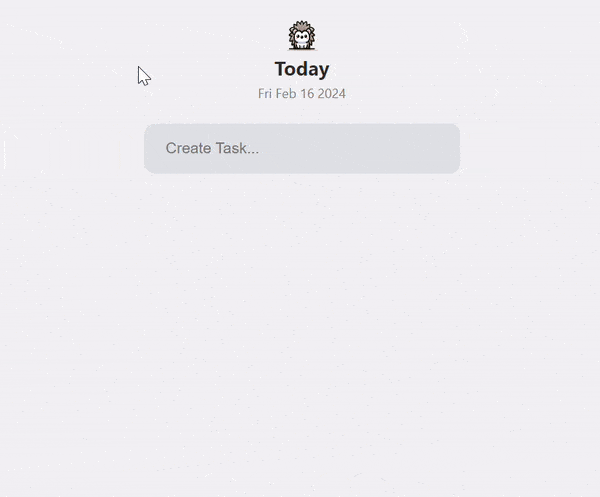
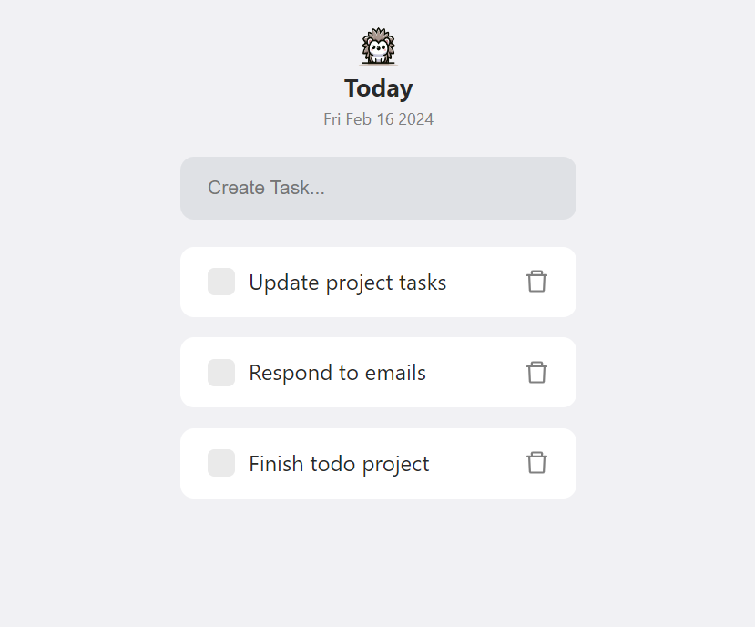
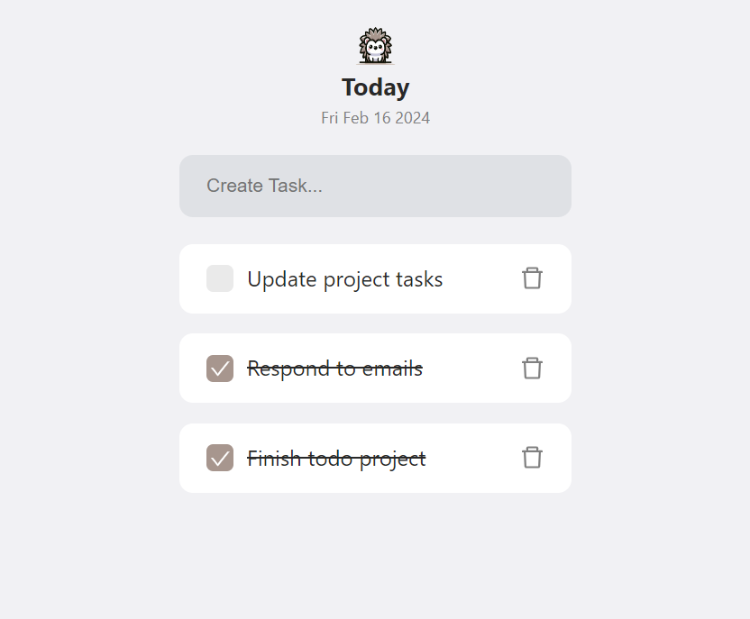

<p align="center">

</p>

<h1 align="center">Hedgehog</h1>

<p align="center">
A simple, lightweight cross-platform todo app using Golang + React.
</p>

<p align="center">🦔🚀📝</p>

<p align="center">

</p>

<table>
  <tr>
    <td valign="top"></td>
    <td valign="top"></td>
  </tr>
</table>

## Run Locally / Live Development

Install dependencies (inside frontend directory)

```bash
  npm install
```

Run in live development mode

```bash
  wails dev
```

This will run a Vite development
server that will provide very fast hot reload of your frontend changes. If you want to develop in a browser
and have access to your Go methods, there is also a dev server that runs on http://localhost:34115. Connect
to this in your browser, and you can call your Go code from devtools.

## Building

To build a redistributable, production mode package, use `wails build`.
